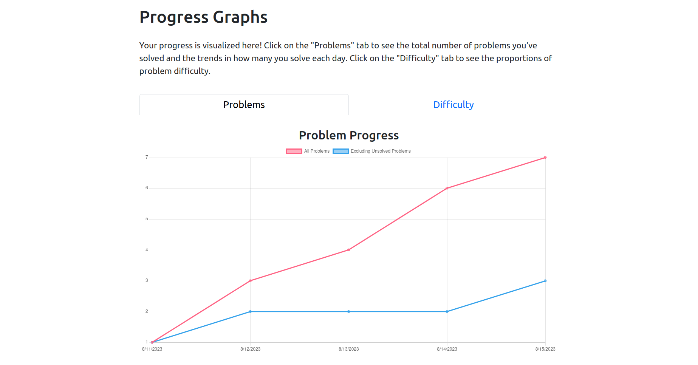
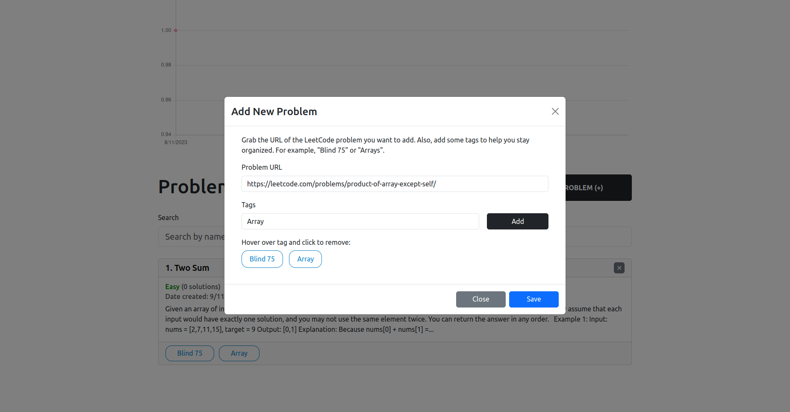
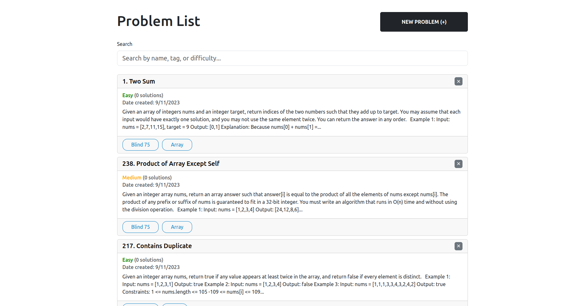
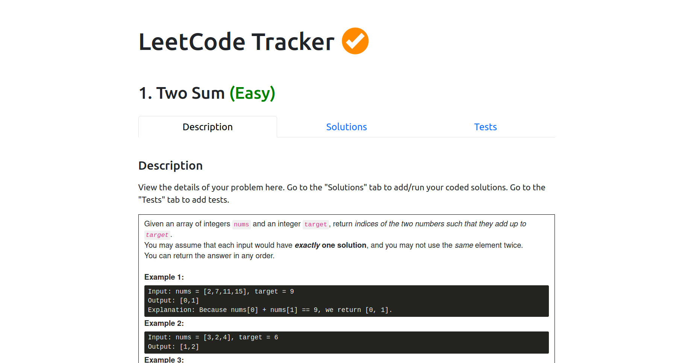
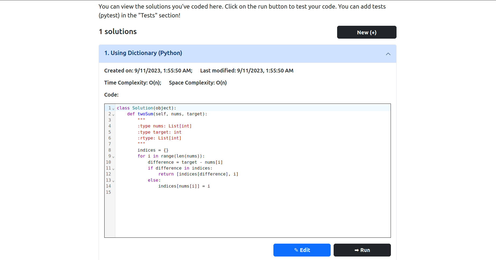
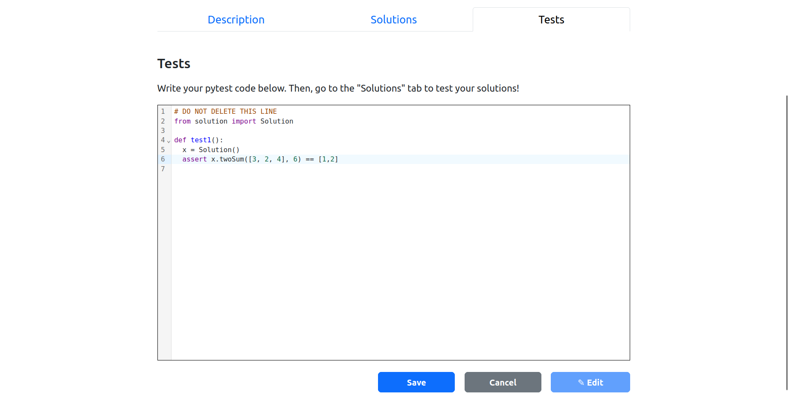
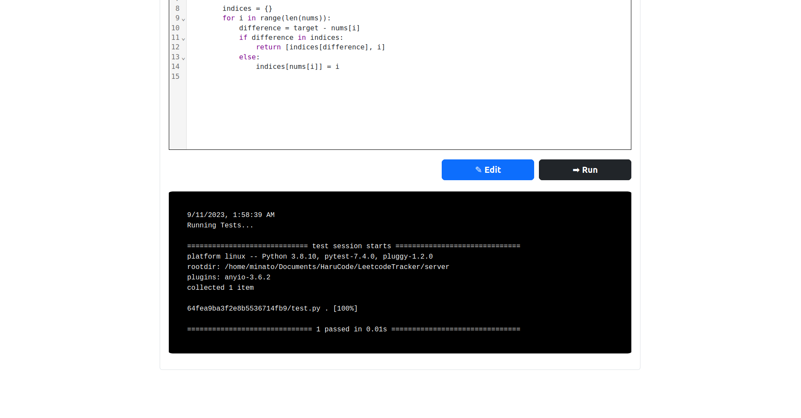

## This is HaruCode (A LeetCode Progress Tracker):


To run and build the project, use the command:
```
sudo docker compose up --build --force-recreate
```

### This is an example of one of the progress graphs generated by the site (date by number of questions solved)



### Enter problems by providing URL (automatically scraped from the LeetCode page) and view on the Home Screen





### Enter solutions and run your tests on them





Note: As of 9/10/2023, web scraping works for current layout of LeetCode site. May be subject to change.


